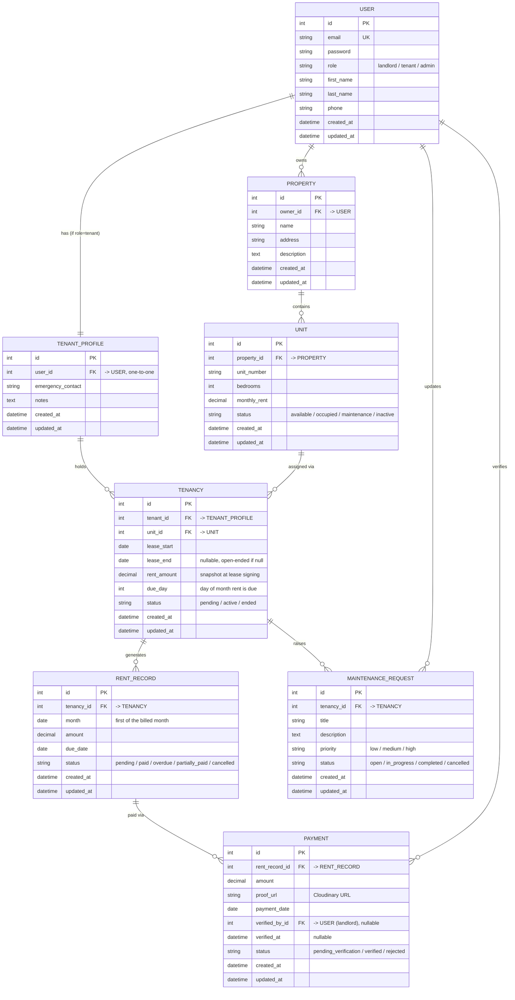

# ER Diagram — Rental & Tenant Management Platform

This renders automatically as a diagram on GitHub/GitLab (mermaid). If your docs
viewer doesn't support mermaid, paste the block into https://mermaid.live to view it.

## Design decisions worth noting

1. **`TENANT_PROFILE` is separate from `USER`, one-to-one.** `USER` handles
   auth/role for everyone (landlord, tenant, future admin). `TENANT_PROFILE`
   holds tenant-only fields, keeping `users` app generic and `tenants` app
   domain-specific — matches the app-per-domain backend split.

2. **`TENANCY` is the join entity between tenant and unit — never a direct FK
   from `TENANT_PROFILE` to `UNIT`.** This is what makes move-outs, unit
   changes, and lease history possible without deleting/overwriting data,
   exactly as called out in the original spec.

3. **`rent_amount` is snapshotted on `TENANCY`, not read live from `UNIT`.**
   If a landlord changes a unit's listed rent later, existing tenants' locked-in
   rent shouldn't silently change — new tenancies pick up the current unit rent
   at signing time.

4. **`RENT_RECORD` is a monthly row generated from a `TENANCY`,** not something
   the tenant or landlord free-types each time — this is what
   `apps/rent/services.py` generates and updates (Phase 4 of the roadmap).

5. **`PAYMENT` is separate from `RENT_RECORD`** to support partial payments —
   one rent record can eventually have multiple payment rows summing toward it,
   and `verified_by`/`verified_at` gives you an audit trail of who confirmed it.

6. **No `ORGANIZATION` entity yet** — that's the Phase 11 multi-tenancy addition;
   when it lands, `PROPERTY.owner_id` conceptually moves under an org, but
   nothing above needs to be redesigned for it, just extended.
